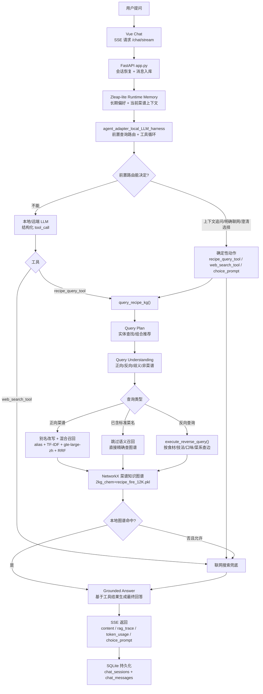

# MiniCookingAgent-Demo — 迷你烹饪问答机器人

这是一个迷你烹饪问答机器人项目，基于 FastAPI + Vue + OpenAI 兼容本地/远端模型工具循环实现，面向菜谱、食材和烹饪技法等中文问答场景。

## 核心架构图

下面这张图来自 [doc/USER_MESSAGE_CALL_CHAIN.md](doc/USER_MESSAGE_CALL_CHAIN.md) 的主链路，README 里放的是压缩版总览：



## 能做什么

- 直接回答烹饪、食材、菜谱、菜单相关问题。
- 使用 `recipe_query_tool` 查询本地菜谱知识图谱（约 7.5 万节点、35.8 万条关系、13214 道菜），支持正向属性查询、反向关系查询、完整档案查询。
- **Query Understanding**：反向查询先经过结构化意图识别，区分食材、技法、口味、菜系；不确定时追问，不靠模型硬猜。
- **图谱节点名词召回**：反向查询的向量化对象是图谱节点名词（如 `牛肉`、`香辣味`、`川菜`、`蒸制`），不是菜谱正文。
- **混合菜名召回**：正向菜谱问题使用别名、字符 TF-IDF、`gte-large-zh` 向量和 RRF 融合，把“西红柿炒鸡蛋”归一到图谱标准菜名。
- **精确菜名保护**：如果用户问题已经包含图谱标准菜名（如“小炒黄牛肉”），跳过语义改写，直接查图谱，避免别名误替换。
- **前置查询路由**：`route_query()` 在模型工具循环前处理打招呼/非菜谱直答、图谱统计、上下文属性追问、澄清选择、明确联网、已知菜名和菜谱意图。
- **结构化反向执行**：反向查询绕过旧自然语言 parser，通过 `execute_reverse_query()` 直接查图谱节点和边关系。
- **Grounded Answer**：最终回答有 4 级确定性兜底（联网结果→联网提议→反向查询→菜谱命中），尽量不走模型生成。
- **Clarification Gate**：多类型歧义词（如"蒜蓉"可能指辅料或技法）返回结构化追问，不走模型硬猜。
- 使用 `web_search_tool` 联网搜索公开网页资料（本地图谱未命中时自动兜底）。
- 可自动通过 SSH 隧道连接远端 LM Studio 的 OpenAI 兼容 API。
- **对话持久化**：后端重启后用同一个 `session_id` 恢复对话历史和菜谱上下文。
- **偏好记忆**：跨会话记住用户偏好（通过 SQLite 持久化）。
- **Token 用量追踪**：实时估算和记录每轮对话的 tokens 消耗。

## 项目结构

```text
miniCookingAgent-Demo/
├── backend/
│   ├── app.py                              # FastAPI 主应用
│   ├── context_manager.py                  # 对话上下文组装（Zleap 风格）
│   ├── agent_adapter_local_LLM_harness.py  # 推荐适配器（前置查询路由 + 工具循环）
│   ├── agent_adapter_local_LLM.py          # 本地 vLLM 基础版
│   ├── agent_adapter.py                    # DeepSeek API 适配器
│   ├── agent_tools.py                      # 工具定义（@tool 装饰器）
│   ├── tool_calling.py                     # 工具调用解析/执行/trace
│   ├── recipe_query_adapter.py             # 菜谱查询适配器（含三层分流）
│   ├── query_understanding.py              # 查询意图识别（正向/反向/歧义/非菜谱）
│   ├── query_plan.py                       # 结构化查询计划
│   ├── query_executor.py                   # 查询执行器
│   ├── answer_composer.py                  # 查询结果格式化
│   ├── clarification_gate.py               # 歧义追问门控
│   ├── recipe_semantic_retriever.py        # 语义召回改写层
│   ├── token_usage_tracker.py              # Token 用量估算
│   ├── memory_store.py                     # 会话内存缓存 + SQLite 持久化
│   ├── chat_persistence.py                 # SQLite 读写层（chat_sessions / chat_messages）
│   ├── preference_memory.py                # 用户偏好记忆存储
│   ├── session_recipe_context.py           # 当前会话菜谱上下文管理
│   └── 4-V1菜谱查询recipe_query-查询火力.py  # 菜谱知识图谱查询系统
├── config/
│   ├── 2kg_chem+recipe_fire_12K.pkl        # 默认菜谱知识图谱（13214 道菜，含 50 道火力增强菜）
│   ├── chem+recipe_kg_updated_fire.pkl     # 小图备份（50 道火力增强菜）
│   ├── build_stats.json                    # 图谱构建统计
│   ├── recepi/                             # 实体/关系/属性配置文件
│   ├── recipe_aliases.json                 # 菜名同义词典
│   └── reverse_entity_aliases.json         # 反向查询实体归并配置
├── frontend/
│   ├── src/
│   │   ├── components/Chat/
│   │   │   ├── ChoicePromptCard.vue        # 歧义追问选择卡片
│   │   │   └── TokenUsageBadge.vue         # Token 用量显示
│   │   ├── stores/
│   │   │   └── chat.ts                     # 聊天状态 + SSE 解析
│   │   └── types/chat.ts                   # 消息类型定义
│   └── package.json
├── test/
│   ├── recipe_test_data.py                   # 150 条单轮测试用例数据
│   ├── run_recall_test.py                    # 召回率测试运行器（可联网兜底）
│   ├── multiturn_test_data.py                # 20 个多轮对话测试 case
│   ├── run_multiturn_dialogue_test.py        # 多轮对话测试运行器（真实 agent 链路）
│   ├── run_all_tests.py                      # 全量测试入口
│   ├── test_query_understanding.py           # Query Understanding 单元测试
│   ├── test_query_plan.py                    # 查询计划单元测试
│   ├── test_answer_composer.py               # 答案格式化单元测试
│   ├── test_clarification_gate.py            # 歧义追问单元测试
│   ├── test_chat_persistence.py              # 对话持久化单元测试
│   ├── test_zleap_lite_memory.py             # Zleap-lite 记忆系统测试
│   ├── test_recipe_query_adapter_guardrails.py # 适配器防护测试
│   └── test_tool_routing_guardrails.py       # 工具路由防护测试
├── doc/
│   ├── USER_MESSAGE_CALL_CHAIN.md            # 完整调用链文档（含 7 张流程图）
│   ├── query_understanding_refactor_plan.md  # Query Understanding 重构方案
│   ├── zleap_lite_chat_persistence_plan.md   # 持久化设计方案
│   └── memory_zleap_lite_plan.md             # 记忆系统设计
├── Dockerfile                                 # 依赖环境 Docker 镜像
├── docker/
│   └── docker-entrypoint.sh
├── deploy_uv.sh                               # uv 一键部署脚本
├── start_docker.sh                            # Docker 一键构建并启动脚本
├── .env.example
├── requirements.txt
└── start.py
```

## 新机器部署

推荐使用 uv 部署脚本。它会安装后端依赖、前端依赖，并默认下载 `gte-large-zh` embedding 模型到 `models/gte-large-zh`：

```bash
bash deploy_uv.sh
```

常用选项：

```bash
# 跳过模型下载
bash deploy_uv.sh --skip-model

# 跳过前端依赖，只安装后端依赖并下载 embedding 模型
bash deploy_uv.sh --skip-frontend

# 部署完成后直接启动
bash deploy_uv.sh --start

# 网络或 CI 环境下顺序安装，便于定位失败日志
bash deploy_uv.sh --no-parallel
```

脚本默认优先使用本机 Python；缺 Python 时 uv 会按 `UV_PYTHON_INSTALL_MIRROR` 下载解释器。Python/npm 包索引默认使用官方源，可按网络情况切镜像：

```ini
UV_INDEX_URL=
NPM_REGISTRY=https://registry.npmmirror.com
MODEL_SOURCE=modelscope
MODELSCOPE_MODEL_ID=AI-ModelScope/gte-large-zh
UV_PYTHON_INSTALL_MIRROR=https://registry.npmmirror.com/-/binary/python-build-standalone/
UV_CONCURRENT_DOWNLOADS=8
UV_CONCURRENT_BUILDS=4
```

如果 HuggingFace 镜像报 `SSL: UNEXPECTED_EOF_WHILE_READING`，优先使用默认的 `MODEL_SOURCE=modelscope`。

Windows 建议：

- 推荐在 Git Bash 里运行 `bash deploy_uv.sh`。
- 如果系统里的 `bash` 是 `C:\Windows\System32\bash.exe`，它会进入 WSL。不要用 WSL bash 混跑 Windows `.venv`。

## Docker 一键启动

项目提供 Docker 一键启动脚本。镜像会在构建时安装 Python/前端依赖，并下载 `gte-large-zh` embedding 模型。项目源码和 `.env` 通过 volume 从本机读取。

`start_docker.sh` **只支持在 Ubuntu / WSL / Linux shell 内运行**。Windows 用户请先进入 WSL/Ubuntu。

```bash
cd /mnt/e/miniCookingAgent-Demo
bash start_docker.sh
```

常用选项：

```bash
# 强制重新构建镜像
bash start_docker.sh --rebuild

# 改宿主机端口
bash start_docker.sh --backend-port 18000 --frontend-port 15173

# 切换模型下载来源
MODEL_SOURCE=huggingface bash start_docker.sh --rebuild
```

## 快速启动

PowerShell：

```powershell
cd E:\miniCookingAgent-Demo
.\.venv\Scripts\python.exe start.py
```

Git Bash：

```bash
cd /e/miniCookingAgent-Demo
.venv/Scripts/python.exe start.py
```

默认会启动：

- 后端：`http://localhost:8000`
- 前端：`http://localhost:5173`
- 默认适配器：`agent_adapter_local_LLM_harness`

调试大模型返回值：

```bash
.venv/Scripts/python.exe start.py --debug-llm
```

## 本地模型配置

`.env` 里已经按本地模型模式配置：

```ini
LLM_MODEL=qwen3-4b
LLM_BASE_URL=http://127.0.0.1:51234/v1
LLM_API_KEY=not-needed
LLM_MAX_TOKENS=2048
LLM_NO_THINK=1
MAX_MODEL_LEN=32768
MAX_TOOL_TURNS=10
MAX_TOTAL_TOOL_CALLS=16
MAX_CONSECUTIVE_TOOL_CALLS=5
```

如果远端 LM Studio 只监听 `127.0.0.1:1234`，可以开启 SSH 隧道：

```ini
LLM_SSH_TUNNEL=0
# LLM_REMOTE_HOST=your.server.com
# LLM_REMOTE_USER=ubuntu
# LLM_REMOTE_PASSWORD=your_password
# LLM_REMOTE_PORT=1234
# LLM_LOCAL_PORT=51234
```

## 工具循环说明

推荐适配器是 `backend/agent_adapter_local_LLM_harness.py`。它把运行时实际注册的工具列表塞进中文系统提示词，并让模型通过结构化 `tool_call` 调用：

### 前置查询路由

进入模型工具循环前，`stream_search_agent()` 会先调用 `route_query(user_text, history)`。这个路由器返回四类动作：`content`、`direct_chat`、`tool`、`fallback_tool_loop`。

当前真实顺序是：

- **图谱统计**：如“本地收录多少道菜”，直接调用 `recipe_query_tool`。
- **上下文属性追问**：如果历史里有当前菜品，用户只问“火力呢”“需要哪些调料”“注意事项”，会补全成“当前菜品 + 属性”后调用 `recipe_query_tool`。
- **Clarification Gate**：`decide_clarification()` 处理明确联网、已知菜名、缺菜名属性问题、疑似错字菜名、口味+食材的推荐/单菜歧义。
- **意图分类**：`classify_intent()` 将打招呼和非菜谱问题直接回答；将上下文追问、正向菜谱、未知菜谱、反向查询路由到 `recipe_query_tool`；无法覆盖时才进入模型工具循环。

### 工具循环

前置路由返回 `fallback_tool_loop` 的问题才进入模型工具循环：

- `recipe_query_tool(query)`：查询本地菜谱知识图谱，内部经过三层分流：
  1. **Query Plan 层**（`query_plan.py`）：实体查找/组合推荐
  2. **Query Understanding 层**（`query_understanding.py`）：意图分类为 forward_recipe_query / reverse_query / ambiguous_query / non_recipe_query / forward_unknown_recipe_query / legacy_forward_parser
  3. **旧链路**：标准菜名短路 + 别名改写 + 混合召回 + 旧 parser 正向查询
- `web_search_tool(query)`：联网搜索公开网页信息；用户明确要求联网时可直接调用，本地图谱未命中且允许兜底时也会自动补一次。

反向查询（如"牛肉怎么做""哪些菜用了蒜蓉""有什么川菜推荐"）不再进入旧自然语言 parser，而是通过 `execute_reverse_query()` 直接查图谱节点和边关系（`USES_MAIN_INGREDIENT` / `USES_TECHNIQUE` / `HAS_TASTE` / `BELONGS_TO_CUISINE`）。

### 最终回答约束

工具执行完成后，`_emit_final_answer_from_tool_context()` 按以下优先级兜底：

1. **联网结果** → `_build_grounded_web_fallback_answer()`
2. **联网提议** → `_build_grounded_web_search_offer_answer()`
3. **反向查询结果** → `_build_grounded_reverse_answer()`
4. **正向菜谱结果** → `_build_grounded_recipe_answer()`
5. 以上都不满足 → content-only 模型 `_stream_model_answer()`

前三者直接 yield 结构化文本，不走模型，节省 token 且输出可控。

### 工具循环限制

- `MAX_TOOL_TURNS`：最多模型工具回合数（默认 10）。
- `MAX_TOTAL_TOOL_CALLS`：本轮总工具调用上限（默认 16）。
- `MAX_CONSECUTIVE_TOOL_CALLS`：同一个工具最多连续调用次数（默认 5）。

## 多轮记忆与持久化

项目实现了轻量级的 Zleap-lite 记忆系统：

1. **会话菜谱上下文**：当前会话的最近菜品、查询、菜谱摘要，注入到每轮 prompt 中，支持"它蒸多久""刚才那道菜"等指代追问。
2. **用户偏好记忆**：通过 SQLite 跨会话保存用户偏好（如口味偏好、常用食材）。
3. **对话持久化**：后端重启后用同一个 `session_id` 恢复完整对话历史、trace 和菜谱上下文。

### 存储结构

| 表 | 用途 |
| --- | --- |
| `chat_sessions` | 会话元信息 + 菜谱上下文快照 |
| `chat_messages` | 顺序消息 + assistant 的 `rag_trace_json`（含 `token_usage`） |

写入路径同时写内存缓存和 SQLite；`get_session()` 先查内存，未命中则从 SQLite hydrate。

## 调试与测试

### 编译检查

```bash
python -m compileall backend start.py
```

### 全量测试

```bash
PYTHONIOENCODING=utf-8 .venv/Scripts/python.exe test/run_all_tests.py
```

### 测试总览

| 测试类型 | 运行命令 | 用例数 | 覆盖 |
| ------- | ------- | ----- | ---- |
| 单轮召回率 | `python test/run_recall_test.py --phase all` | 150 条 | 正向/反向/模糊/边界 + 联网兜底 |
| 多轮对话 | `python test/run_multiturn_dialogue_test.py --all` | 20 个 case | 记忆/抗干扰/逻辑自洽 + DeepSeek LLM 裁判 |
| 持久化 | `python test/test_chat_persistence.py` | 6 项 | SQLite round-trip / hydrate / archive |
| Zleap-lite 记忆 | `python test/test_zleap_lite_memory.py` | 9 项 | 偏好记忆 + 菜谱上下文渲染 |
| Query Understanding | `python -m unittest test.test_query_understanding` | 17 项 | 意图分类（正向/反向/歧义/非菜谱） |
| 查询计划 | `python -m unittest test.test_query_plan` | — | Query Plan 单元测试 |
| 答案格式化 | `python -m unittest test.test_answer_composer` | — | 结果格式化测试 |
| 歧义追问 | `python -m unittest test.test_clarification_gate` | — | Clarification Gate 测试 |

### 多轮对话测试

测试 agent 行为的三大能力：

```bash
# 全部类别（需远端 LLM + DeepSeek 裁判）
PYTHONIOENCODING=utf-8 python test/run_multiturn_dialogue_test.py --all

# 单独跑某一类
python test/run_multiturn_dialogue_test.py --category memory
python test/run_multiturn_dialogue_test.py --category distraction
python test/run_multiturn_dialogue_test.py --category contradiction
```

多轮测试使用**真实 agent 链路**（`stream_search_agent`），不走 mock。DeepSeek 作为 LLM 裁判，输出结构化 JSON 判定每个 case 是否通过。配置 `DEEPSEEK_API_KEY` 环境变量启用裁判。

### 测试输出

- `test/test_results.json` — 单轮测试详细结果
- `test/test_report.md` — 单轮测试报告
- `test/multiturn_test_results.json` — 多轮测试详细结果
- `test/multiturn_test_report.md` — 多轮测试报告

### 知识图谱文件

默认菜谱知识图谱位于 `config/2kg_chem+recipe_fire_12K.pkl`（约 51MB），包含 **75242 个节点、358690 条关系、13214 道菜**。其中 `chem+recipe_kg_updated_fire.pkl` 是小图备份，包含 50 道带 `fire_control_process` 的火力增强菜；大图已经完整包含小图节点、边和火力字段。

图谱通过 `pickle` 反序列化为 `networkx.DiGraph`，查询层基于：

- `dish_nodes`：菜名到节点 ID 的索引。
- `all_nodes_by_label`：实体类型到节点名的索引。
- `graph.edges()` / `graph.in_edges()`：正向和反向关系遍历。

### 调用链文档

完整调用链见 [doc/USER_MESSAGE_CALL_CHAIN.md](doc/USER_MESSAGE_CALL_CHAIN.md)，包含 Mermaid 流程图（总流程 / 会话恢复 / 前置查询路由 / query_recipe_kg 内部 / runtime memory / 最终回答约束 / SSE 渲染）。README 上方的“核心架构图”是该文档主链路的压缩版。
