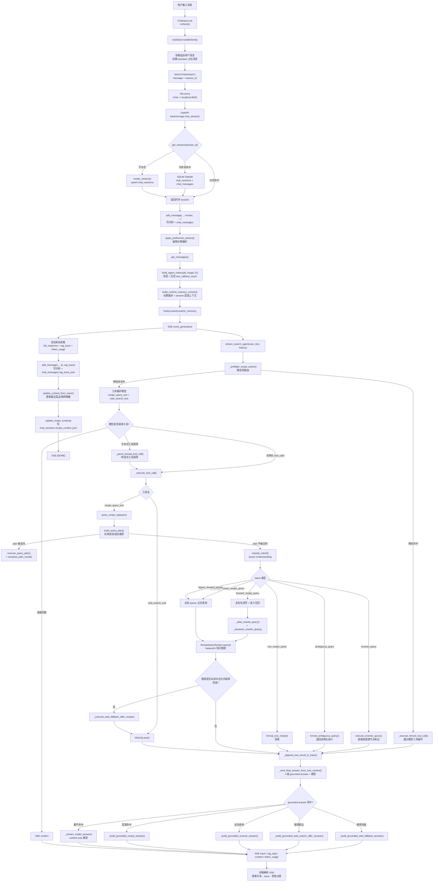
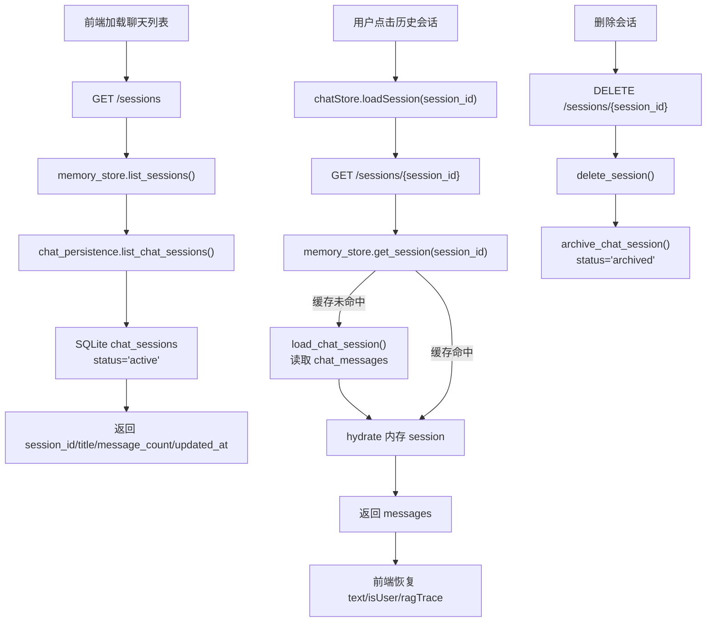
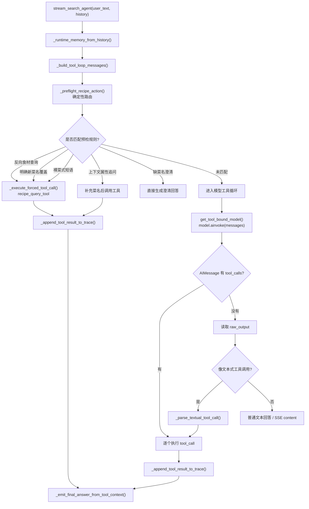
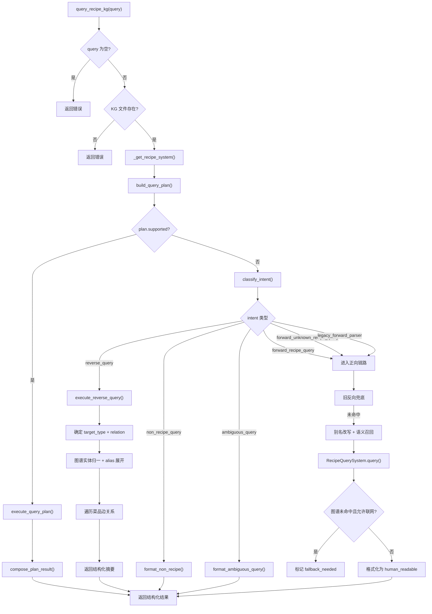
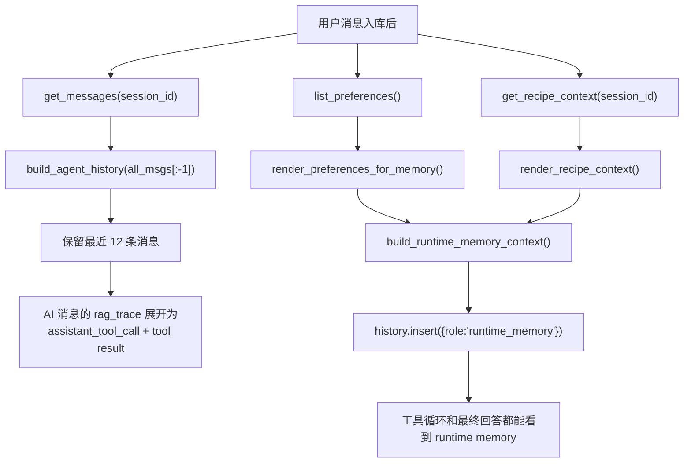
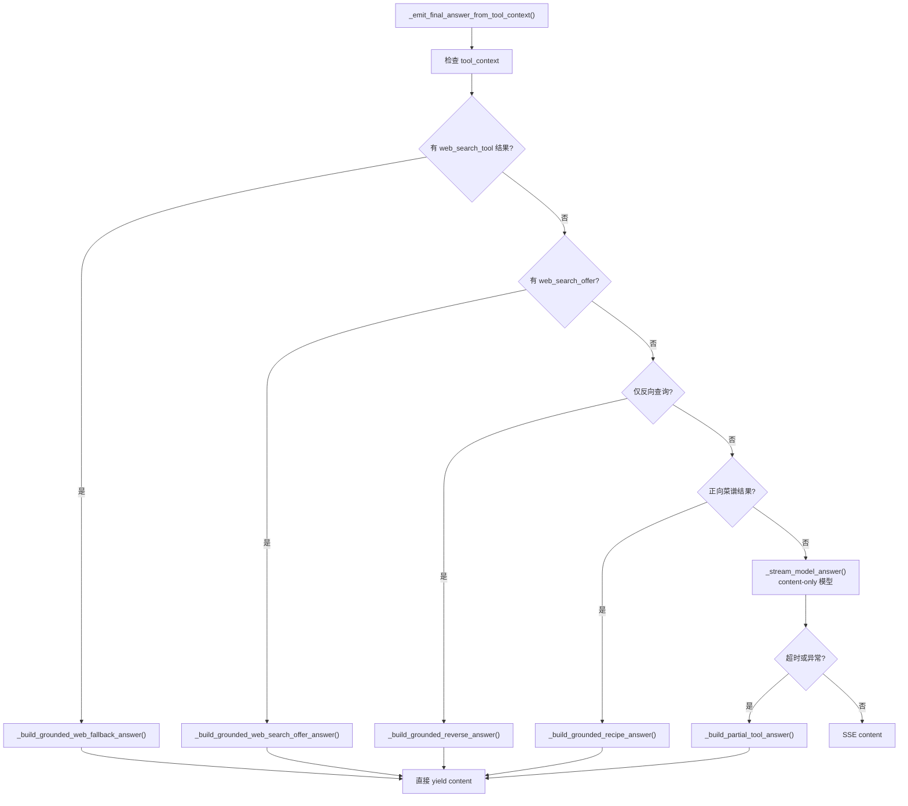
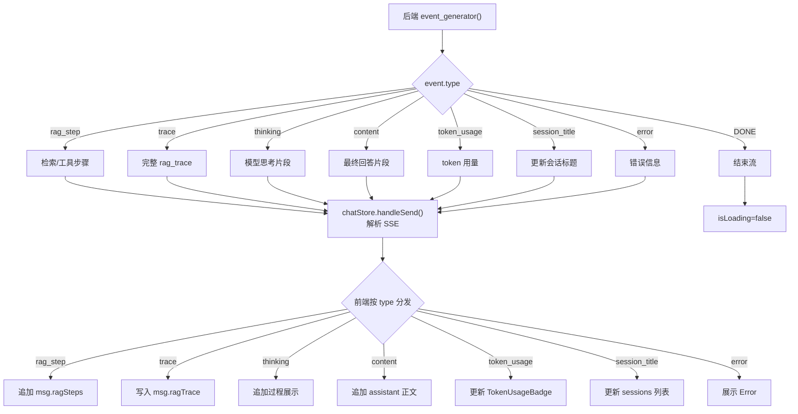

# 用户发消息后的调用链

本文说明 MiniCookingAgent-Demo 当前版本在用户发送一条消息后，从前端、会话持久化、runtime memory、确定性菜谱路由、Agent 工具循环，到 Query Understanding、结构化反向查询、菜谱混合召回、知识图谱查询、联网兜底、最终回答约束、SSE 回传和 SQLite 落库的完整链路。

## 当前关键变化

- 前端仍通过 `session_id` 维持当前对话；历史会话从 `/sessions/{session_id}` 恢复消息和 `rag_trace`。
- 后端 `memory_store` 是运行期缓存，`data/memory.sqlite3` 是进程重启后的事实来源。
- 用户消息写入后，会立即抽取长期偏好并写入 `preference_memory`。
- 每轮请求都会构造 Zleap-lite runtime memory，注入长期偏好和当前 session 菜谱上下文。
- `stream_search_agent()` 先跑 `_preflight_recipe_action()`，对无菜名属性追问、明确菜名覆盖旧上下文等高风险问题做确定性路由，再决定是否进入模型工具循环。
- `recipe_query_tool` 仍是唯一菜谱工具。Query Understanding、结构化反向查询、菜谱混合召回、别名改写都藏在这个工具内部。
- `query_recipe_kg()` 现在有三层分流：
  1. **Query Plan 层**（`query_plan.py`）：处理实体查找和组合推荐
  2. **Query Understanding 层**（`query_understanding.py`）：分类意图为 forward/reverse/ambiguous/non-recipe/forward-unknown
  3. **旧链路**：别名改写 + 语义召回 + 旧 parser 正向查询
- 反向查询（如"牛肉怎么做""哪些菜用了牛肉"）会先产出结构化 `QueryIntent(reverse_query)`，由 `execute_reverse_query()` 直接查图谱，不进入旧 parser。
- 反向查询的归并值输出必须展示，如"归并食材：牛肉、黄牛肉、牛里脊、肥牛"。
- 多类型歧义词（如"蒜蓉"）返回 `ambiguous_query`，不硬拆。
- `_emit_final_answer_from_tool_context()` 有 4 级 grounded answer 兜底：
  1. 联网兜底结果 → `_build_grounded_web_fallback_answer()`
  2. 图谱未命中联网提议 → `_build_grounded_web_search_offer_answer()`
  3. 本地图谱反向查询结果 → `_build_grounded_reverse_answer()`
  4. 正向菜谱命中结果 → `_build_grounded_recipe_answer()`
  5. 以上都不满足时 → content-only 模型
- assistant 最终回答和本轮 `rag_trace` 会一起持久化；随后根据 trace 更新当前 session 的 `recipe_context_json`。

## 0. 总流程图



## 0.1 会话恢复与持久化链路



持久化表：

```text
data/memory.sqlite3
  ├─ chat_sessions
  │   ├─ id
  │   ├─ title
  │   ├─ status
  │   ├─ recipe_context_json
  │   ├─ created_at / updated_at
  │   └─ archived_at
  ├─ chat_messages
  │   ├─ id
  │   ├─ session_id
  │   ├─ role: human / ai
  │   ├─ content
  │   ├─ rag_trace_json（含 token_usage）
  │   └─ created_at / deleted_at
  └─ preference_memory
      └─ 跨会话用户偏好
```

## 0.2 Agent 工具决策 + 预检路由



## 0.3 query_recipe_kg 内部链路



## 0.4 runtime memory 注入链路



## 0.5 最终回答约束链路



## 0.6 SSE 回传与前端渲染



## 1. 关键文件

```text
frontend/src/stores/chat.ts           # handleSend() SSE 解析
  → backend/app.py                     # POST /chat/stream
    → backend/memory_store.py          # session 缓存 / SQLite 双写
    → backend/chat_persistence.py      # SQLite 层
    → backend/context_manager.py       # 历史 + runtime memory
    → backend/preference_memory.py     # 用户偏好
    → backend/session_recipe_context.py
    → backend/agent_adapter_local_LLM_harness.py
      → _preflight_recipe_action()
      → stream_search_agent()
        → recipe_query_tool
          → backend/recipe_query_adapter.py
            → backend/query_plan.py
            → backend/query_understanding.py
            → backend/query_executor.py
            → backend/answer_composer.py
            → backend/recipe_semantic_retriever.py
            → backend/4-V1菜谱查询recipe_query-查询火力.py
        → web_search_tool
      → _emit_final_answer_from_tool_context()
        → 4 级 grounded answer / _stream_model_answer()
    → backend/token_usage_tracker.py
    → update_context_from_trace()
    → update_recipe_context()
```
