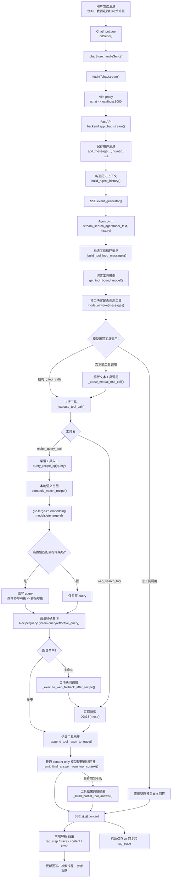
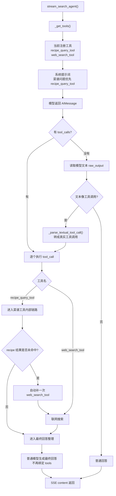
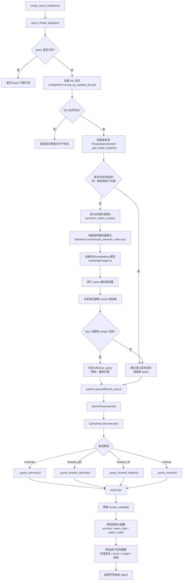
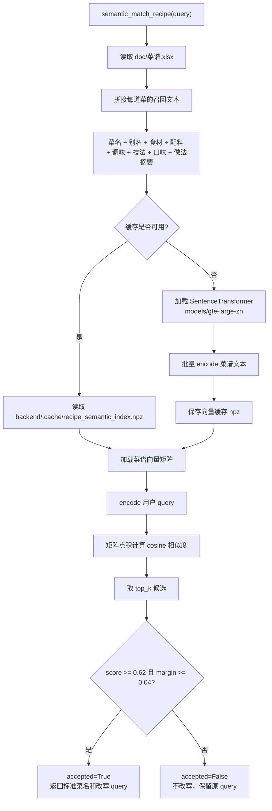
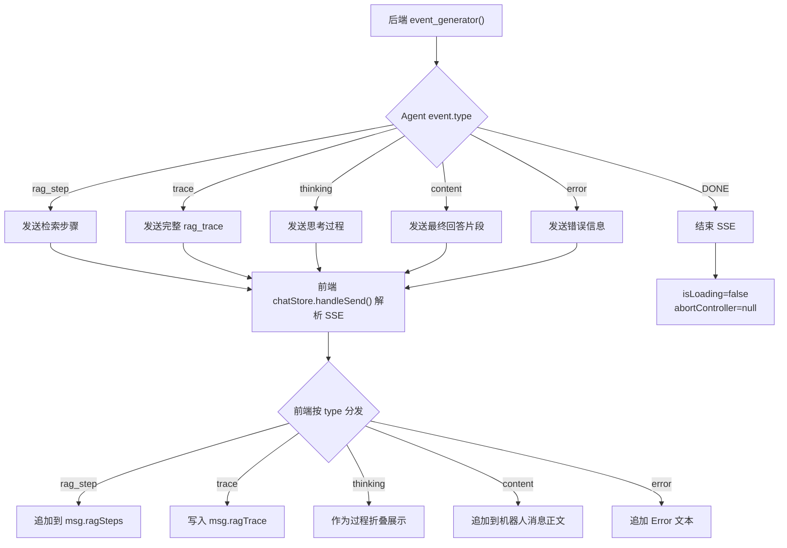

# 用户发消息后的调用链

本文说明 MiniCookingAgent-Demo 在用户发送一条消息后，从前端、后端、Agent 工具循环，到本地向量召回、菜谱知识图谱精确检索、联网兜底、最终回答回传的完整链路。

当前重要变化：

- `recipe_query_tool` 仍然是暴露给大模型的唯一菜谱工具。
- 向量召回层不暴露为 Agent 工具，而是藏在 `recipe_query_tool` 内部。
- 菜谱类问题会先用本地 `gte-large-zh` 做语义召回，把自然说法归一到图谱标准菜名。
- 归一成功后，再调用原来的 NetworkX 菜谱知识图谱精确查询。
- 本地图谱未命中时，后端仍可自动补一次 `web_search_tool`。

## 0. 总流程图



## 0.1 Agent 工具决策流程图



## 0.2 recipe_query_tool 内部流程图



## 0.3 向量召回层流程图



## 0.4 SSE 回传与前端渲染流程图



## 1. 前端输入与发送

1. 用户在 `frontend/src/components/Chat/ChatInput.vue` 输入消息。
2. `onSend()` 调用 `chatStore.handleSend()`。
3. `frontend/src/stores/chat.ts` 的 `handleSend()`：
   ```ts
   fetch('/chat/stream', {
     method: 'POST',
     body: JSON.stringify({
       message: text,
       session_id: this.sessionId,
     })
   })
   ```
4. 前端先创建用户消息和机器人占位消息，之后持续接收 SSE 更新。

## 2. Vite 代理到后端

开发模式下，`frontend/vite.config.ts` 将：

```text
/chat
```

代理到：

```text
http://localhost:8000
```

因此前端请求：

```text
POST /chat/stream
```

实际进入后端：

```text
POST http://localhost:8000/chat/stream
```

## 3. FastAPI 接收请求

后端入口在 `backend/app.py`：

```python
chat_stream(body: ChatRequest)
```

主要动作：

1. 创建或更新 session。
2. 保存用户消息：
   ```python
   add_message(body.session_id, "human", body.message)
   ```
3. 读取历史消息：
   ```python
   all_msgs = get_messages(body.session_id)
   ```
4. 构造 Agent 历史上下文：
   ```python
   history = build_agent_history(all_msgs[:-1])
   ```
5. 进入 SSE 生成器：
   ```python
   event_generator()
   ```

## 4. Agent 入口

SSE 生成器调用：

```python
stream_search_agent(body.message, history)
```

当前默认适配器来自 `.env`：

```text
AGENT_ADAPTER=agent_adapter_local_LLM_harness
```

实际实现文件：

```text
backend/agent_adapter_local_LLM_harness.py
```

Agent 会构造工具循环消息，然后绑定当前工具：

```python
_get_tools()
```

当前注册工具只有：

```text
recipe_query_tool
web_search_tool
```

`find_tool` 和 `read_file_tool` 代码仍在，但当前不注册。

## 5. 工具调用解析

模型可能返回两种工具调用形式。

第一种是标准结构化调用：

```json
{
  "name": "recipe_query_tool",
  "args": {"query": "我要吃西红柿炒鸡蛋"}
}
```

第二种是小模型常见的文本式调用：

```text
recipe_query_tool("我要吃西红柿炒鸡蛋")
```

后端兼容这两种形式：

```python
_parse_textual_tool_call(raw_output)
_execute_tool_call(call)
```

## 6. recipe_query_tool 现在的完整链路

当模型调用：

```python
recipe_query_tool("我要吃西红柿炒鸡蛋")
```

实际调用链是：

```text
backend/agent_tools.py
  -> recipe_query_tool(query)
  -> backend.recipe_query_adapter.query_recipe_kg(query)
  -> _get_recipe_system()
  -> _semantic_rewrite_query(query, system)
  -> backend.recipe_semantic_retriever.semantic_match_recipe(query)
  -> SentenceTransformer(models/gte-large-zh)
  -> backend/.cache/recipe_semantic_index.npz
  -> 得到标准菜名：番茄炒蛋
  -> 改写 effective_query：番茄炒蛋
  -> RecipeQuerySystem.query("番茄炒蛋")
  -> QueryParser.parse()
  -> QueryExecutor.execute()
  -> _query_summary()
  -> 返回 human_readable
```

具体例子：

```text
用户：我要吃西红柿炒鸡蛋
```

向量召回层结果：

```text
top1: 番茄炒蛋
score: 0.633
margin: 0.057
accepted: True
```

图谱精查实际收到：

```text
番茄炒蛋
```

图谱返回：

```text
match_mode: exact
query_type: summary
```

## 7. 火力类问题的链路

如果用户问：

```text
西红柿炒鸡蛋的火力怎么控制
```

向量召回层先归一菜名：

```text
西红柿炒鸡蛋 -> 番茄炒蛋
```

然后根据用户意图改写为：

```text
番茄炒蛋的火力调节过程
```

图谱执行的是属性查询：

```text
QueryParser.parse()
  -> type: forward_attr
  -> target_name: fire_control_process
```

最终返回：

```text
番茄炒蛋的 fire_control_process
match_mode: exact
```

## 8. 反向查询为什么跳过向量改写

像下面这种问题：

```text
哪些菜用了包菜
```

它不是“用户说了一道菜的别名”，而是“按食材反查菜品”。

因此 `query_recipe_kg()` 会先判断：

```python
_looks_like_reverse_recipe_query(query)
```

命中后跳过语义菜名改写，直接让原图谱解析器处理：

```text
QueryParser.parse("哪些菜用了包菜")
  -> reverse 查询
```

这样可以避免把“包菜”错误召回成某一道具体菜。

## 9. 向量缓存机制

向量索引文件：

```text
backend/.cache/recipe_semantic_index.npz
```

缓存内容：

```text
version
names
documents
embeddings
```

缓存失效条件：

- `doc/菜谱.xlsx` 修改时间变化
- 菜名列表变化
- 菜谱召回文本变化
- embedding 模型路径变化

首次启动会慢一点，因为需要加载 `gte-large-zh` 并构建菜谱向量。后续会直接读取 `.npz` 缓存。

## 10. 本地图谱未命中后的联网兜底

如果执行 `recipe_query_tool` 后返回内容包含：

```text
success: False
未找到菜品
无法理解的查询格式
```

后端会判断：

```python
_recipe_query_needs_web_fallback(content)
```

如果需要兜底，会自动执行：

```python
_execute_web_fallback_after_recipe(...)
```

也就是补一次：

```text
web_search_tool
```

然后把本地图谱结果和联网搜索结果一起交给最终回答模型整理。

## 11. 最终回答生成

工具执行完成后，后端不会继续调用绑定 tools 的模型，而是切换到普通 content-only 模型：

```python
_emit_final_answer_from_tool_context()
```

它会构造最终回答提示词：

```python
_build_final_prompt(user_text, trace, tool_context)
```

再调用：

```python
_stream_model_answer()
```

如果最终回答模型失败，会走兜底摘要：

```python
_build_partial_tool_answer()
```

这能避免之前那种“工具已经有结果，但最终回答阶段又输出工具调用文本”的问题。

## 12. Trace 与前端展示

工具结果会写入：

```python
trace["tool_calls"]
trace["retrieved_chunks"]
```

其中：

- `recipe_query_tool` 结果写入 `retrieved_chunks`
- `web_search_tool` 结果写入 `retrieved_chunks`
- 语义召回摘要会附在 `recipe_query_tool` 返回文本里

前端会把这些内容展示到：

```text
检索过程
参考文献 / 检索详情
最终回答
```

## 13. 当前完整链路概览

```text
ChatInput.vue onSend()
  -> chatStore.handleSend()
  -> fetch('/chat/stream')
  -> Vite proxy /chat -> localhost:8000
  -> backend.app.chat_stream()
  -> add_message(..., "human", ...)
  -> build_agent_history()
  -> event_generator()
  -> stream_search_agent(user_text, history)
  -> _build_tool_loop_messages()
  -> get_tool_bound_model()
  -> model.ainvoke(messages)
  -> tool_calls 或文本式工具调用
  -> _execute_tool_call()
     -> recipe_query_tool(query)
        -> query_recipe_kg(query)
        -> _get_recipe_system()
        -> _semantic_rewrite_query(query, system)
           -> semantic_match_recipe(query)
           -> 加载/读取 recipe_semantic_index.npz
           -> SentenceTransformer(models/gte-large-zh)
           -> query embedding
           -> cosine 相似度 top_k
           -> 高置信时得到标准菜名
           -> 改写 effective_query
        -> RecipeQuerySystem.query(effective_query)
        -> QueryParser.parse()
        -> QueryExecutor.execute()
        -> _query_summary() / _query_forward_attribute() / _query_reverse()
        -> human_readable + 结构化摘要 + 语义召回摘要
     -> 或 web_search_tool(query)
        -> DDGS().text()
  -> _append_tool_result_to_trace()
  -> recipe 未命中时 _execute_web_fallback_after_recipe()
  -> _emit_final_answer_from_tool_context()
  -> _build_final_prompt()
  -> _stream_model_answer()
  -> SSE: trace / rag_step / content / error
  -> frontend chatStore.handleSend() 解析 SSE
  -> 更新消息、检索过程、参考文献
  -> backend 保存 AI 回复和 rag_trace
```

## 14. 一个真实例子

用户输入：

```text
我要吃西红柿炒鸡蛋
```

现在链路是：

```text
Agent 判断这是菜谱问题
  -> 调 recipe_query_tool
  -> query_recipe_kg("我要吃西红柿炒鸡蛋")
  -> semantic_match_recipe()
  -> gte-large-zh 召回 top1 = 番茄炒蛋
  -> score=0.633，margin=0.057，超过阈值
  -> effective_query = "番茄炒蛋"
  -> RecipeQuerySystem.query("番茄炒蛋")
  -> 图谱 exact 命中
  -> 返回番茄炒蛋完整档案
  -> 最终回答模型整理成自然语言做法
  -> SSE 推给前端展示
```

这就是现在加了向量之后的核心变化：**向量层负责把用户自然表达翻译成图谱标准菜名，图谱层负责精确返回结构化菜谱知识。**
