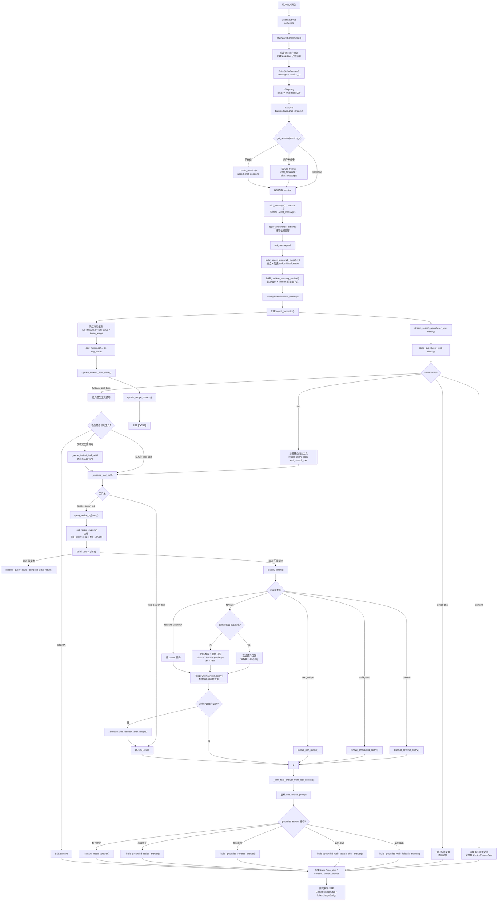
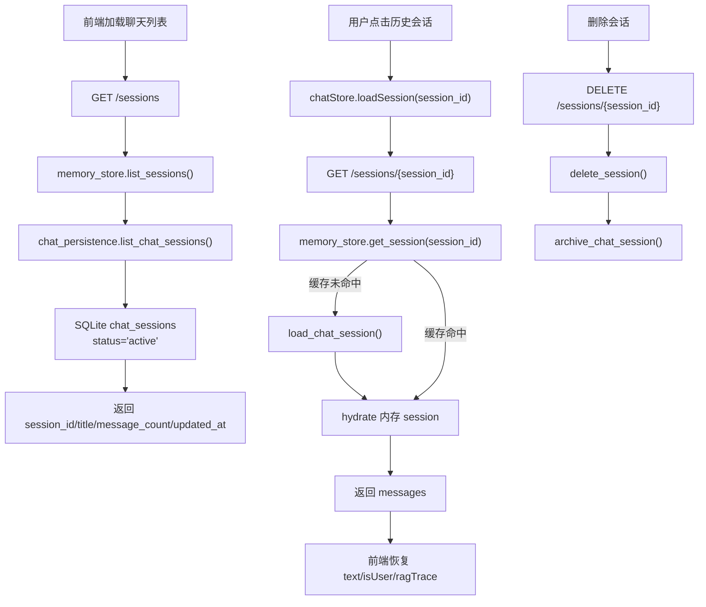
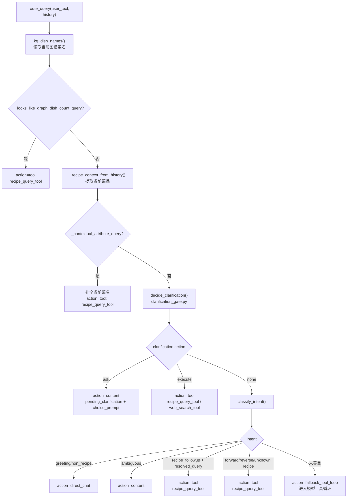
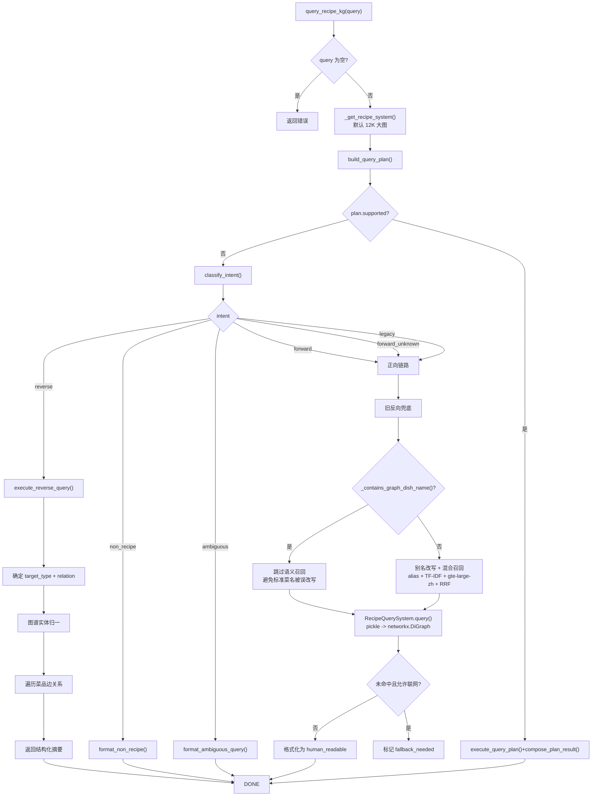
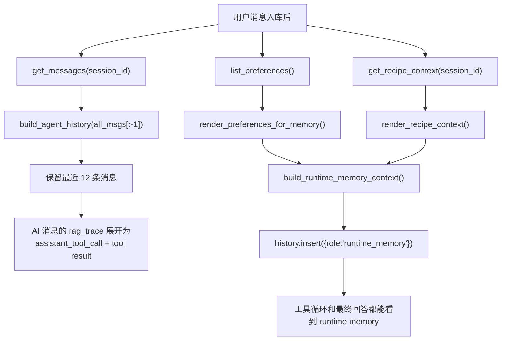
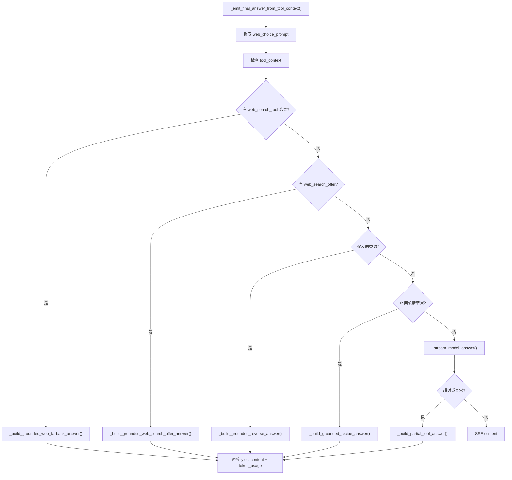
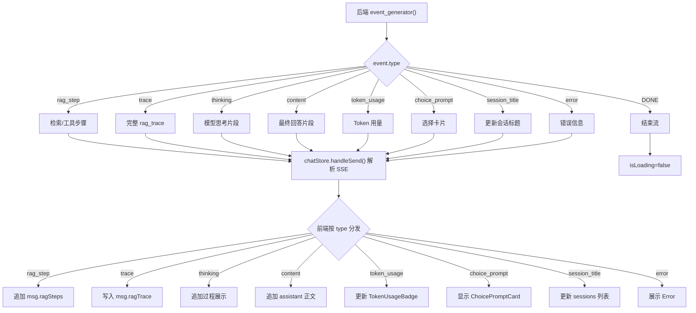

# 用户发消息后的调用链

本文说明 MiniCookingAgent-Demo 当前版本在用户发送一条消息后，从前端、会话持久化、runtime memory、确定性菜谱路由、Agent 工具循环、Clarification Gate、Context Followup Gate、Query Understanding、结构化反向查询、菜谱混合召回、12K 菜谱知识图谱查询、联网兜底、最终回答约束、SSE 回传和 SQLite 落库的完整链路。

## 当前关键变化

- 前端仍通过 `session_id` 维持当前对话；历史会话从 `/sessions/{session_id}` 恢复消息和 `rag_trace`。
- 后端 `memory_store` 是运行期缓存，`data/memory.sqlite3` 是进程重启后的事实来源。
- 用户消息写入后，会立即抽取长期偏好并写入 `preference_memory`。
- 每轮请求都会构造 Zleap-lite runtime memory，注入长期偏好和当前 session 菜谱上下文。
- `stream_search_agent()` 先跑 `route_query(user_text, history)`，返回 `content` / `direct_chat` / `tool` / `fallback_tool_loop` 四类动作。
- `route_query()` 当前顺序是：图谱统计 → 当前菜品属性追问补全 → `decide_clarification()` → `classify_intent()` → 必要时退回模型工具循环。
- `decide_clarification()` 会处理明确联网、已知菜名、缺菜名属性问题、疑似错字菜名、口味+食材的推荐/单菜歧义，并在需要时返回 ChoicePromptCard。
- `recipe_query_tool` 仍是唯一菜谱工具。Query Understanding、结构化反向查询、菜谱混合召回、别名改写都藏在这个工具内部。
- 默认知识图谱已经切到 `config/2kg_chem+recipe_fire_12K.pkl`：约 7.5 万节点、35.8 万条关系、13214 道菜；旧小图 `chem+recipe_kg_updated_fire.pkl` 仅作为备份。
- `query_recipe_kg()` 现在有三层分流：
  1. **Query Plan 层**（`query_plan.py`）：处理实体查找和组合推荐
  2. **Query Understanding 层**（`query_understanding.py`）：分类意图
  3. **旧链路**：标准菜名短路 + 别名改写 + 混合召回 + 旧 parser 正向查询
- 反向查询通过 `execute_reverse_query()` 直接查图谱节点和边关系。
- 正向菜谱查询如果已经包含图谱标准菜名（如“小炒黄牛肉”），会跳过语义召回，直接进入 `RecipeQuerySystem.query()`，避免别名把标准菜名误改写成别的菜。
- 菜名召回使用 alias、字符 TF-IDF、`gte-large-zh` dense embedding 和 RRF 融合；索引缓存位于 `backend/.cache/recipe_semantic_index.npz`，菜名列表或 Excel 变化后会自动重建。
- `_emit_final_answer_from_tool_context()` 新增 Choice Prompt 集成（web_search_choice_prompt），前端展示选择卡片。
- assistant 最终回答和本轮 `rag_trace`（含 `token_usage` 和 `choice_prompt`）一起持久化。

## 0. 总流程图



## 0.1 会话恢复与持久化链路



## 0.2 前置查询路由 + Clarification Gate



## 0.3 query_recipe_kg 内部链路



## 0.4 runtime memory 注入链路



## 0.5 最终回答约束链路



## 0.6 SSE 事件与前端渲染



## 1. 关键文件

```text
frontend/src/stores/chat.ts
  → backend/app.py
    → backend/memory_store.py / chat_persistence.py
    → backend/context_manager.py
    → backend/session_recipe_context.py
    → backend/agent_adapter_local_LLM_harness.py
      → route_query()
        → clarification_gate.py / query_understanding.py
      → stream_search_agent()
        → recipe_query_tool
          → backend/recipe_query_adapter.py
            → backend/query_plan.py
            → backend/query_understanding.py
            → backend/query_executor.py / answer_composer.py
            → backend/recipe_semantic_retriever.py
        → web_search_tool
      → _emit_final_answer_from_tool_context()
        → grounded answer cascade
    → backend/token_usage_tracker.py
    → update_context_from_trace() / update_recipe_context()
```
