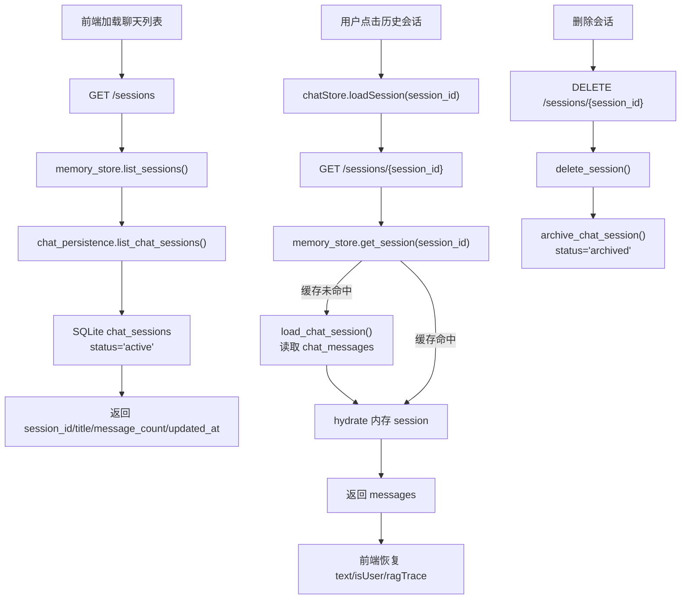
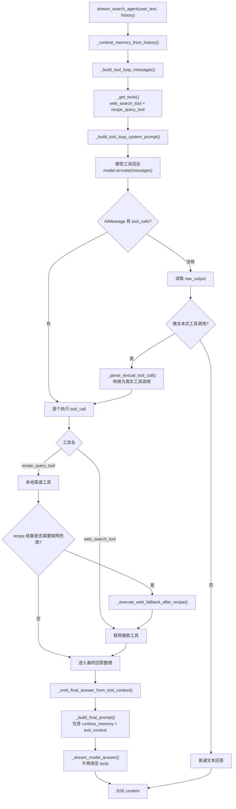
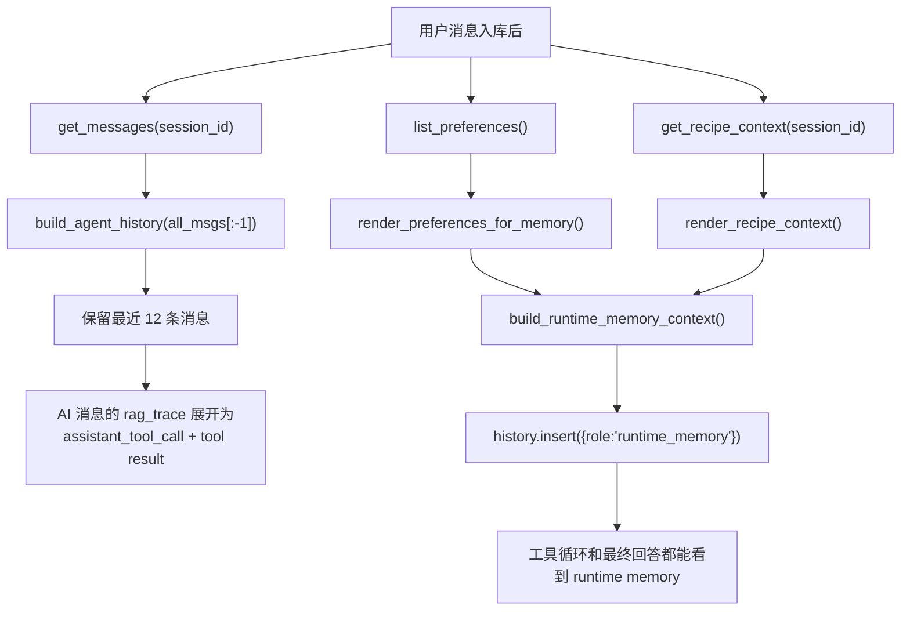
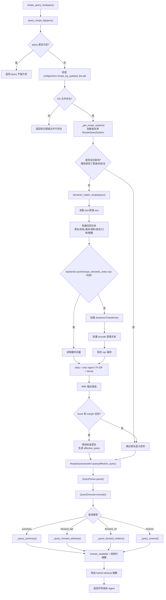
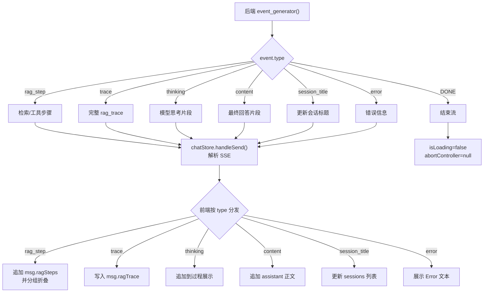

# 用户发消息后的调用链

本文说明 MiniCookingAgent-Demo 当前版本在用户发送一条消息后，从前端、会话持久化、runtime memory、Agent 工具循环，到菜谱混合召回、知识图谱查询、联网兜底、SSE 回传和 SQLite 落库的完整链路。

## 当前关键点

- 前端通过 `session_id` 维持当前对话；打开历史会话时从 `/sessions/{session_id}` 恢复消息和 `rag_trace`。
- 后端 `memory_store` 是运行期缓存，`data/memory.sqlite3` 是进程重启后的事实来源。
- 用户消息写入后，会立即抽取长期偏好并写入 `preference_memory`。
- 每轮请求都会构造 Zleap-lite runtime memory，注入长期偏好和当前 session 菜谱上下文。
- `recipe_query_tool` 是唯一暴露给模型的菜谱工具；语义召回、别名、TF-IDF、RRF 和知识图谱查询都藏在这个工具内部。
- 本地图谱明确允许联网兜底且未命中时，工具循环自动补一次 `web_search_tool`。
- assistant 最终回答和本轮 `rag_trace` 会一起持久化；随后根据 trace 更新当前 session 的 `recipe_context_json`。
- Docker 镜像内可通过 `MINICOOK_EMBEDDING_MODEL_DIR=/opt/minicook/models/gte-large-zh` 使用内置 embedding 模型；本机部署默认使用 `models/gte-large-zh`。

## 0. 总流程图

```mermaid
flowchart TD
    A["用户输入消息"] --> B["ChatInput.vue<br/>onSend()"]
    B --> C["chatStore.handleSend()"]
    C --> C1["前端追加用户消息<br/>创建 assistant 占位消息"]
    C1 --> D["fetch('/chat/stream')<br/>message + session_id"]
    D --> E["Vite proxy<br/>/chat -> localhost:8000"]
    E --> F["FastAPI<br/>backend.app.chat_stream()"]

    F --> G{"get_session(session_id)"}
    G -->|内存命中| H["返回内存 session"]
    G -->|内存未命中| I["SQLite hydrate<br/>chat_sessions + chat_messages"]
    I --> H
    G -->|不存在| J["create_session()<br/>upsert chat_sessions"]
    J --> H

    H --> K["add_message(..., human, ...)<br/>写内存 + chat_messages"]
    K --> L["apply_preference_actions()<br/>抽取长期偏好"]
    L --> M["get_messages()"]
    M --> N["build_agent_history(all_msgs[:-1])<br/>消息 + 历史 tool_call/tool_result"]
    N --> O["build_runtime_memory_context()<br/>长期偏好 + session 菜谱上下文"]
    O --> P["history.insert(runtime_memory)"]
    P --> Q["SSE event_generator()"]

    Q --> R["stream_search_agent(user_text, history)"]
    R --> S["工具循环模型<br/>recipe_query_tool + web_search_tool"]
    S --> T{"模型是否调用工具?"}
    T -->|结构化 tool_calls| U["_execute_tool_call()"]
    T -->|文本式工具调用| V["_parse_textual_tool_call()<br/>转真实工具调用"]
    V --> U
    T -->|直接回答| W["SSE content"]

    U --> X{"工具名"}
    X -->|recipe_query_tool| Y["query_recipe_kg(query)"]
    X -->|web_search_tool| Z["DDGS().text()"]

    Y --> AA["semantic_match_recipe()<br/>alias + TF-IDF + dense + RRF"]
    AA --> AB["SentenceTransformer<br/>MINICOOK_EMBEDDING_MODEL_DIR 或 models/gte-large-zh"]
    AB --> AC["RecipeQuerySystem.query(effective_query)<br/>NetworkX 知识图谱"]
    AC --> AD{"图谱是否未命中且允许联网兜底?"}
    AD -->|是| AE["_execute_web_fallback_after_recipe()"]
    AE --> Z
    AD -->|否| AF["_append_tool_result_to_trace()"]
    Z --> AF

    AF --> AG["_emit_final_answer_from_tool_context()<br/>普通 content-only 模型整理答案"]
    AG --> AH["SSE trace / rag_step / content"]
    W --> AH
    AH --> AI["前端解析 SSE<br/>更新文本、trace、检索过程"]

    Q --> AJ["流结束后收集 full_response + rag_trace"]
    AJ --> AK["add_message(..., ai, rag_trace)<br/>写内存 + chat_messages.rag_trace_json"]
    AK --> AL["update_context_from_trace()<br/>更新最近菜品/联网摘要"]
    AL --> AM["update_recipe_context()<br/>写 chat_sessions.recipe_context_json"]
    AM --> AN["SSE [DONE]"]
```



## 0.1 会话恢复与持久化链路



持久化表：

```text
data/memory.sqlite3
  ├─ chat_sessions
  │   ├─ id
  │   ├─ title
  │   ├─ status
  │   ├─ recipe_context_json
  │   ├─ created_at / updated_at
  │   └─ archived_at
  ├─ chat_messages
  │   ├─ id
  │   ├─ session_id
  │   ├─ role: human / ai
  │   ├─ content
  │   ├─ rag_trace_json
  │   └─ created_at / deleted_at
  └─ preference_memory
      └─ 跨会话用户偏好
```

## 0.2 Agent 工具决策流程图



工具选择规则当前写在 `backend/agent_adapter_local_LLM_harness.py` 的系统提示词中：

- 菜谱、菜式、想吃某道菜、做法、备菜、烹饪、火力、食材、调料、技法、口味、菜系等问题，必须先调用 `recipe_query_tool`。
- 明显非菜谱问题，如打招呼、天气、模型身份，不调用 `recipe_query_tool`。
- 只有用户明确要联网、在线、最新信息，或本地图谱未命中且允许公共网页补充时，才调用 `web_search_tool`。

## 0.3 runtime memory 注入链路



runtime memory 包含：

- 用户长期偏好：例如不能吃辣、偏好清淡、没有烤箱。
- 当前 session 菜谱上下文：最近菜品、最近问题、最近菜谱摘要、最近联网兜底摘要。
- 使用规则：用户说“它/这道菜/刚才那道菜/这个火候”时，优先指向当前 session 最近菜品。

## 0.4 `recipe_query_tool` 内部链路



embedding 模型路径：

```text
优先：MINICOOK_EMBEDDING_MODEL_DIR
本机默认：models/gte-large-zh
Docker 默认：/opt/minicook/models/gte-large-zh
```

向量缓存：

```text
backend/.cache/recipe_semantic_index.npz
```

缓存版本会纳入：

- `doc/菜谱.xlsx` 内容与修改时间。
- 菜名列表和召回文本。
- embedding 模型路径。

## 0.5 SSE 回传与前端渲染



## 1. 前端发送消息

入口文件：

```text
frontend/src/stores/chat.ts
```

`handleSend()` 的关键动作：

1. 将用户输入追加到前端 `messages`。
2. 如果是当前 session 第一条消息，先在前端会话列表里插入临时标题。
3. 创建 assistant 占位消息，用于接收 SSE 增量内容。
4. 请求后端：

```ts
fetch('/chat/stream', {
  method: 'POST',
  body: JSON.stringify({
    message: text,
    session_id: this.sessionId,
  }),
})
```

5. 循环读取 SSE，根据 `type` 更新正文、trace、检索过程和标题。

历史会话恢复走：

```text
chatStore.loadSession(sessionId)
  -> GET /sessions/{session_id}
  -> messages[].rag_trace 恢复到前端 msg.ragTrace
```

## 2. FastAPI 接收请求

入口：

```text
backend/app.py
POST /chat/stream
```

关键步骤：

```python
session = get_session(body.session_id)
if not session:
    create_session(body.session_id)
    update_session_title(body.session_id, body.message[:20])

add_message(body.session_id, "human", body.message)
apply_preference_actions(body.message, source_session_id=body.session_id)

all_msgs = get_messages(body.session_id)
history = build_agent_history(all_msgs[:-1])
runtime_memory = build_runtime_memory_context(
    preferences=list_preferences(),
    recipe_context=get_recipe_context(body.session_id),
)
history.insert(0, {"role": "runtime_memory", "content": runtime_memory})
```

这一步有两个重要效果：

- 当前用户消息会立即持久化。
- 模型看到的上下文不是纯文本历史，而是“消息 + 历史工具结果 + runtime memory”。

## 3. 会话持久化

相关文件：

```text
backend/memory_store.py
backend/chat_persistence.py
```

写入路径：

```text
add_message()
  -> 写入内存 _sessions
  -> append_chat_message()
  -> 写入 chat_messages
```

恢复路径：

```text
get_session(session_id)
  -> 先查 _sessions
  -> 缓存未命中时 load_chat_session()
  -> 从 SQLite 读取 chat_sessions + chat_messages
  -> hydrate 回 _sessions
```

assistant 回复保存：

```text
stream 收集 full_response + rag_trace
  -> add_message(session_id, "ai", full_response, rag_trace)
  -> chat_messages.rag_trace_json
  -> update_context_from_trace()
  -> update_recipe_context()
  -> chat_sessions.recipe_context_json
```

因此后端重启后，只要前端继续使用同一个 `session_id`，就能恢复：

- 对话消息。
- 每轮 assistant 的 trace。
- 当前 session 的最近菜品和菜谱上下文。

## 4. Agent 工具循环

入口：

```text
backend/agent_adapter_local_LLM_harness.py
stream_search_agent(user_text, history)
```

模型每轮都会拿到：

- 系统提示词。
- 当前注册工具 schema。
- 历史消息。
- 历史工具调用和工具结果。
- runtime memory。

当前注册工具：

```text
recipe_query_tool
web_search_tool
```

工具循环输出的 `rag_trace` 会持续通过 SSE 发给前端，也会在最终 assistant 消息落库时保存。

## 5. 菜谱工具与混合召回

当前 `recipe_query_tool` 不只是简单查图谱，而是一个组合工具：

```text
recipe_query_tool
  -> query_recipe_kg
  -> semantic_match_recipe
     -> alias
     -> char_ngram_tfidf
     -> dense gte-large-zh
     -> RRF fusion
  -> RecipeQuerySystem.query
  -> NetworkX 知识图谱精查
```

对于“辣椒炒肉怎么做”“我想吃清蒸鲈鱼”这类菜式问题，提示词要求模型必须先调用 `recipe_query_tool`，不能直接凭常识回答。

对于“哪些菜用了包菜”这类反向查询，`query_recipe_kg()` 会跳过菜名语义改写，避免把食材误召回成一道菜。

## 6. 联网兜底

联网兜底不是所有失败都触发。

当前逻辑：

```text
recipe_query_tool 返回结果
  -> _recipe_query_needs_web_fallback(content)
  -> 如果 web_fallback_allowed: True 且 success: False
  -> 自动执行 web_search_tool(user_text)
```

边界：

- 本地图谱明确给出相似菜品时，不联网。
- 明显非菜谱问题，不因为历史上下文误触发菜谱工具。
- 只有本地图谱未命中且允许公共网页补充，或者用户明确要求联网，才使用 `web_search_tool`。

## 7. 最终回答生成

工具执行完后，不再继续让绑定 tools 的模型生成最终答案，而是切到普通 content-only 模型：

```text
_emit_final_answer_from_tool_context()
  -> _build_final_prompt(user_text, trace, tool_context, runtime_memory)
  -> _stream_model_answer()
```

这样可以避免模型在最终回答阶段再次输出工具调用文本。

最终回答提示词会包含：

- 用户原问题。
- 工具上下文。
- `rag_trace`。
- runtime memory。

如果最终回答模型超时或失败，会退回到工具结果兜底摘要。

## 8. 一条完整链路概览

```text
ChatInput.vue
  -> chatStore.handleSend()
  -> fetch('/chat/stream', { message, session_id })
  -> backend.app.chat_stream()
  -> get_session()
     -> memory cache hit
     -> 或 SQLite hydrate
  -> add_message(..., "human", ...)
     -> chat_messages
  -> apply_preference_actions()
     -> preference_memory
  -> build_agent_history(all_msgs[:-1])
     -> 最近消息
     -> 历史 rag_trace 展开为工具上下文
  -> build_runtime_memory_context()
     -> 长期偏好
     -> session recipe_context
  -> stream_search_agent(user_text, history)
  -> _build_tool_loop_messages()
  -> get_tool_bound_model()
  -> model.ainvoke(messages)
  -> tool_calls 或文本式工具调用
  -> _execute_tool_call()
     -> recipe_query_tool(query)
        -> query_recipe_kg(query)
        -> semantic_match_recipe()
           -> alias + TF-IDF + dense + RRF
           -> SentenceTransformer(MINICOOK_EMBEDDING_MODEL_DIR 或 models/gte-large-zh)
           -> backend/.cache/recipe_semantic_index.npz
           -> 标准菜名 / effective_query
        -> RecipeQuerySystem.query(effective_query)
        -> QueryParser.parse()
        -> QueryExecutor.execute()
        -> human_readable + 结构化摘要 + hybrid retrieval 摘要
     -> 或 web_search_tool(query)
        -> DDGS().text()
  -> _append_tool_result_to_trace()
  -> 必要时 _execute_web_fallback_after_recipe()
  -> _emit_final_answer_from_tool_context()
  -> SSE: rag_step / trace / content / error / DONE
  -> frontend 更新 assistant 消息、trace、检索过程
  -> add_message(..., "ai", full_response, rag_trace)
     -> chat_messages.rag_trace_json
  -> update_context_from_trace()
  -> update_recipe_context()
     -> chat_sessions.recipe_context_json
```

## 9. 真实例子

用户输入：

```text
我想吃清蒸鲈鱼
```

当前链路：

```text
前端发送 message + session_id
  -> 后端恢复或创建 session
  -> 用户消息写入 SQLite
  -> 偏好提取
  -> 注入 runtime memory
  -> 模型判断这是菜式问题
  -> 必须调用 recipe_query_tool
  -> semantic_match_recipe("我想吃清蒸鲈鱼")
  -> hybrid retrieval 找到标准菜名：清蒸鲈鱼
  -> RecipeQuerySystem.query("清蒸鲈鱼")
  -> 图谱返回做法/火力/备菜等结构化资料
  -> 最终回答模型整理自然语言答案
  -> SSE 推送给前端
  -> assistant 回复 + rag_trace 落库
  -> session recipe_context 更新 last_dish=清蒸鲈鱼
```

下一轮用户问：

```text
它蒸多久？
```

链路变化：

```text
get_session(session_id)
  -> 恢复上一轮 recipe_context
  -> runtime memory 注入最近菜品：清蒸鲈鱼
  -> 模型将“它”解析为清蒸鲈鱼
  -> 再次调用 recipe_query_tool 查询蒸制时间/火力信息
```

这就是当前版本的核心变化：**不再只有一次性 RAG，而是把工具结果、偏好、菜谱上下文和会话历史一起持久化并投影给模型。**
