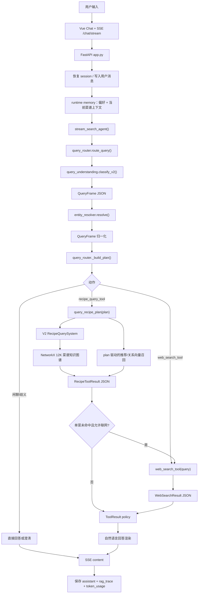
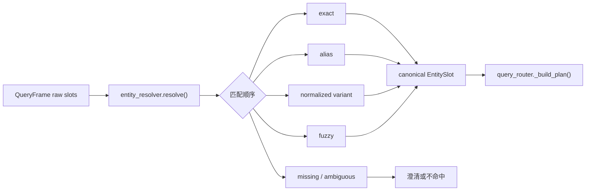
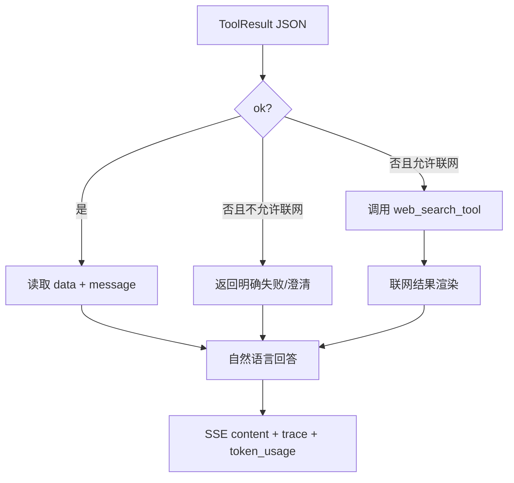

# 用户消息调用链

本文描述当前 V2 架构。旧的 `query_recipe_kg()`、`query_plan.py`、`query_executor.py` 和 `context_followup_gate.py` 已从运行链路移除。

## 总流程



## 1. 意图和上下文

`query_understanding.classify_v2()` 是唯一的意图识别入口。它接收：

- 当前用户输入
- `context_manager` 提供的当前菜谱上下文

它输出经过 JSON Schema 和后处理校验的 `QueryFrame`，包含：

- `intent`
- `dish_text`
- `ingredients`
- `techniques`
- `tastes`
- `cuisines`
- `scenario_tags`
- `exclusions`
- `attribute`
- `followup` 上下文状态

模型连接失败、JSON 非法或置信度不足时，只返回 `ambiguous_query` 并澄清，不恢复旧的语义正则兜底。

上下文追问的处理方式是：

```text
context_manager 提供状态
    -> classify_v2 判断是否继承
    -> QueryFrame.dish 保存继承后的菜名
    -> entity_resolver 校验实体
```

不会再由独立的上下文门控脚本提前改写用户原话。

## 2. 实体归一化与 plan



别名和地方叫法只放在配置文件，不在 Python 文件中继续增加领域关键词：

- `config/recipe_aliases.json`
- `config/reverse_entity_aliases.json`
- `config/recommendation_aliases.json`

工具只接受 `plan`，不接受自然语言 `query`：

```json
{
  "intent": "dish_detail_query",
  "mode": "dish",
  "dish": "番茄炒蛋",
  "field": "fire",
  "source_text": "西红柿炒鸡蛋的火候怎么样"
}
```

## 3. 工具结果协议

`recipe_query_tool` 和 `web_search_tool` 都返回 JSON 兼容对象：

```json
{
  "schema_version": "1.0",
  "ok": true,
  "tool": "recipe_query_tool",
  "query_type": "dish_detail",
  "source": "local_kg",
  "data": {},
  "message": "中文摘要",
  "web_fallback_allowed": false,
  "error": null,
  "meta": {}
}
```

JSON 只在后端内部和调试 trace 中存在。前端最终只显示 `message` 或回答渲染层生成的中文文本。

## 4. 查询执行

`backend/recipe_query_adapter.py` 只做以下事情：

1. 加载/缓存 `RecipeQuerySystem`
2. 执行 `dish`、`combo`、`missing`、图谱统计等 plan
3. 按 plan 选择关系字段向量召回
4. 按 plan 执行推荐向量召回
5. 返回统一 JSON 结果

向量召回不再根据关键词自行触发：

```text
plan.field = fire
    -> fire_control_process

plan.field = prep
    -> prep_process

plan.intent = ingredient_combo_query
    -> 推荐向量
```

联网降级只允许：

```text
单道菜谱查询 + 本地图谱未命中 + web_fallback_allowed=true
```

反向查询、图谱统计和推荐无结果时，默认返回本地图谱未命中，不自动联网替代本地事实。

## 5. 工具循环与上下文预算

- 第一跳工具由 `query_router` 唯一决定。
- 模型不再负责第一跳工具选择。
- 模型只在工具结果之后参与最终回答，且必须服从工具证据。
- 每轮最多 5 次工具调用。
- 相同工具和相同参数重复调用立即停止。
- 同一工具连续无变化调用超过 3 次停止。
- 工具原始结果保留在 trace，但注入模型的是压缩摘要。
- 上下文预算按 token 计算，以远端 `MAX_MODEL_LEN` 为硬上限。

## 6. 最终回答



工具结果优先级高于模型历史记忆和常识。工具未命中时不能编造菜名、做法、用量或来源。

## 7. 测试链路

```bash
conda run -n bigdog python -m pytest -q
```

重点测试：

- QueryFrame JSON/schema 契约
- 实体别名归一化
- `QueryFrame -> plan -> recipe_query_tool`
- ToolResult JSON 协议
- 单菜未命中联网降级
- 推荐和关系向量由 plan 驱动
- 25 个多轮会话 + 40 条单轮问题的回放测试
