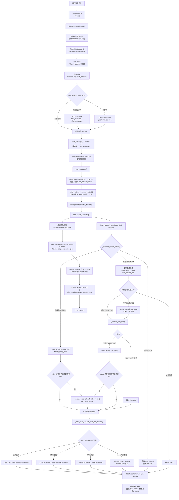
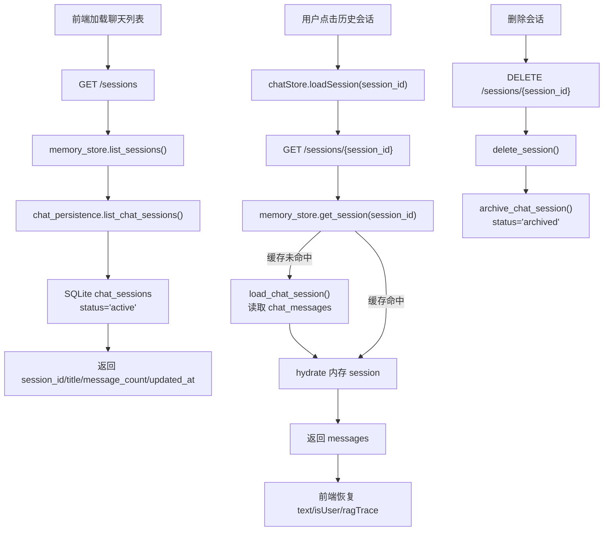
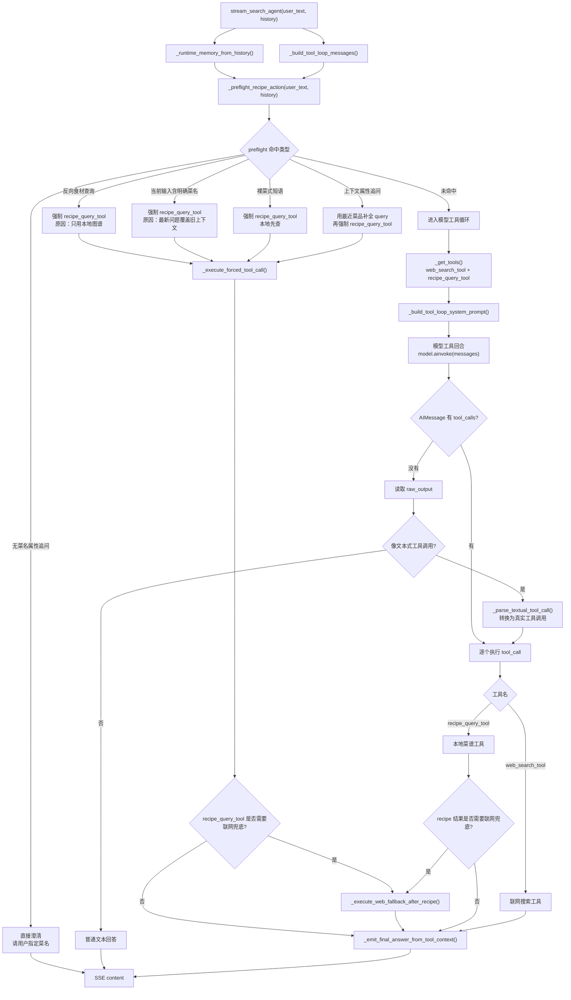
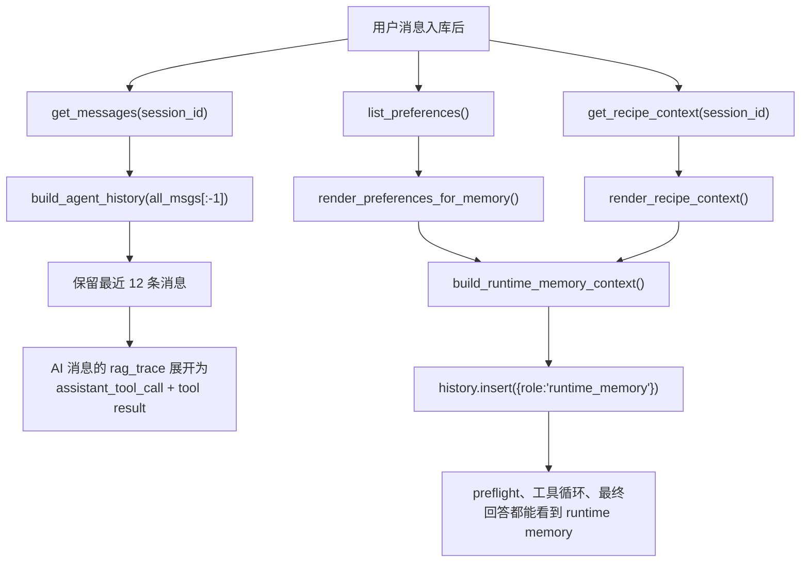
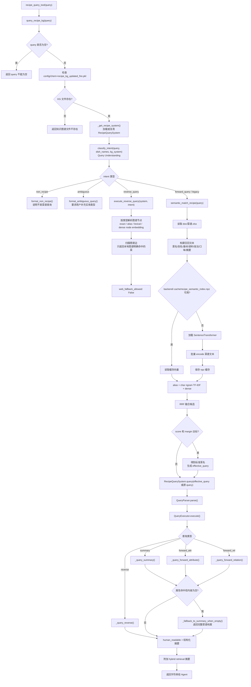
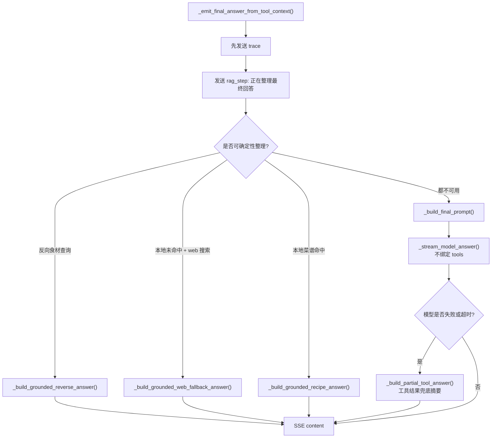
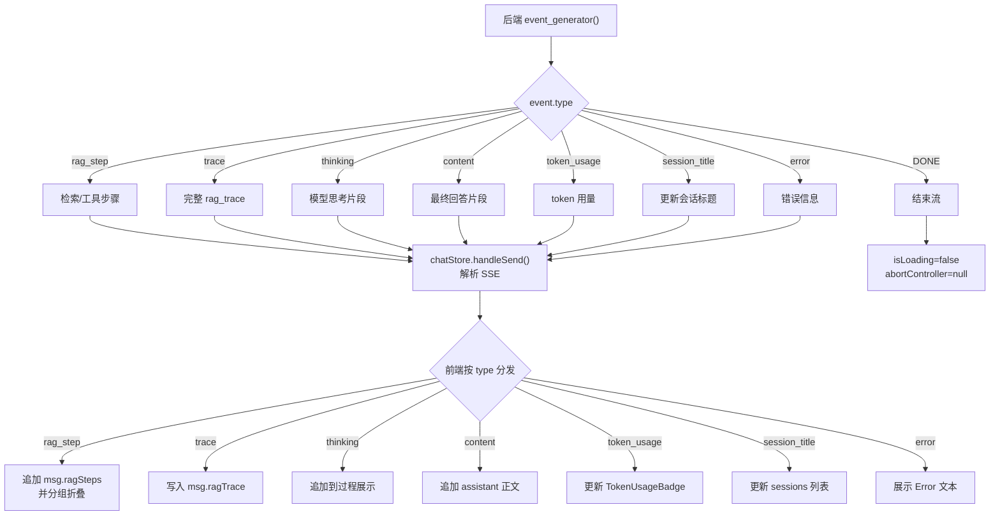

# 用户发消息后的调用链

本文说明 MiniCookingAgent-Demo 当前版本在用户发送一条消息后，从前端、会话持久化、runtime memory、确定性菜谱路由、Agent 工具循环，到 Query Understanding、菜谱混合召回、知识图谱查询、联网兜底、最终回答约束、SSE 回传和 SQLite 落库的完整链路。

## 当前关键变化

- 前端仍通过 `session_id` 维持当前对话；历史会话从 `/sessions/{session_id}` 恢复消息和 `rag_trace`。
- 后端 `memory_store` 是运行期缓存，`data/memory.sqlite3` 是进程重启后的事实来源。
- 用户消息写入后，会立即抽取长期偏好并写入 `preference_memory`。
- 每轮请求都会构造 Zleap-lite runtime memory，注入长期偏好和当前 session 菜谱上下文。
- `stream_search_agent()` 现在先跑 `_preflight_recipe_action()`，对无菜名属性追问、明确菜名覆盖旧上下文等高风险问题做确定性路由，再决定是否进入模型工具循环。
- `recipe_query_tool` 仍是唯一菜谱工具；Query Understanding、反向结构化查询、菜名语义召回、别名、TF-IDF、dense embedding、RRF、知识图谱查询都藏在这个工具内部。
- 反向查询如“牛肉怎么做”“花甲”“川菜”“香辣味”“蒸制”会先产出结构化 `QueryIntent(reverse_query)`，再直接查图谱节点和边，不进入旧自然语言 parser。
- 反向查询的向量化对象是图谱节点名词（Ingredient/Technique/Taste/Cuisine 等），不是菜谱正文；低置信度或多类型歧义时追问用户。
- 无明确菜名的属性追问如“火力要怎么控制”会先要求用户补充菜名，避免被历史上下文或模型常识带偏。
- 本地图谱明确允许联网兜底且未命中时，工具循环自动补一次 `web_search_tool`。
- 最终回答阶段先尝试确定性 grounded answer：反向查询、本地菜谱命中、联网兜底、歧义追问都有专门约束；只有无法确定性整理时才调用 content-only 模型。
- assistant 最终回答和本轮 `rag_trace` 会一起持久化；随后根据 trace 更新当前 session 的 `recipe_context_json`。

## 0. 总流程图



## 0.1 会话恢复与持久化链路



持久化表：

```text
data/memory.sqlite3
  ├─ chat_sessions
  │   ├─ id
  │   ├─ title
  │   ├─ status
  │   ├─ recipe_context_json
  │   ├─ created_at / updated_at
  │   └─ archived_at
  ├─ chat_messages
  │   ├─ id
  │   ├─ session_id
  │   ├─ role: human / ai
  │   ├─ content
  │   ├─ rag_trace_json
  │   └─ created_at / deleted_at
  └─ preference_memory
      └─ 跨会话用户偏好
```

## 0.2 Agent 工具决策流程图



当前 preflight 边界：

- “牛肉可以用来做什么菜”：强制 `recipe_query_tool`，只查本地图谱主食材关系。
- “小炒鸡的具体做法”：如果当前输入包含图谱菜名，强制 `recipe_query_tool`，覆盖旧上下文。
- “藤条焖猪肉”：裸菜式短语先查本地；本地未命中且允许兜底时再联网。
- “它蒸多久”：若 session 最近菜品是“清蒸鲈鱼”，补全为“清蒸鲈鱼蒸多久/火力信息”后查工具。
- “火力要怎么控制”：没有明确菜名且不能可靠指代最近菜品时，直接要求补充菜名。

## 0.3 runtime memory 注入链路



runtime memory 包含：

- 用户长期偏好：例如不能吃辣、偏好清淡、没有烤箱。
- 当前 session 菜谱上下文：最近菜品、最近问题、最近菜谱摘要、最近联网兜底摘要。
- 使用规则：用户说“它/这道菜/刚才那道菜/这个火候”时，优先指向当前 session 最近菜品。
- 冲突规则：如果最新工具结果与 runtime memory 冲突，以最新工具结果为准并纠正旧上下文。

## 0.4 `recipe_query_tool` 内部链路



embedding 模型路径：

```text
优先：MINICOOK_EMBEDDING_MODEL_DIR
本机默认：models/gte-large-zh
Docker 默认：/opt/minicook/models/gte-large-zh
```

向量缓存：

```text
backend/.cache/recipe_semantic_index.npz
```

缓存版本会纳入：

- `doc/菜谱.xlsx` 内容与修改时间。
- 菜名列表和召回文本。
- embedding 模型路径。

## 0.5 最终回答约束链路



约束重点：

- 反向查询答案只能来自工具返回的本地图谱命中列表。
- 本地菜谱命中时，最终回答必须基于图谱用料、步骤、火力、提示整理。
- 本地未命中但联网兜底时，必须明确说明“本地图谱未收录”，再列公开网页摘要；不能说成“根据本地菜谱图谱”。
- 如果搜索工具失败或无结果，回答必须说明无法凭常识编做法。

## 0.6 SSE 回传与前端渲染



## 1. 前端发送消息

入口文件：

```text
frontend/src/stores/chat.ts
frontend/src/components/Chat/ChatInput.vue
```

`handleSend()` 的关键动作：

1. 将用户输入追加到前端 `messages`。
2. 如果是当前 session 第一条消息，先在前端会话列表里插入临时标题。
3. 创建 assistant 占位消息，用于接收 SSE 增量内容。
4. 请求后端：

```ts
fetch('/chat/stream', {
  method: 'POST',
  body: JSON.stringify({
    message: text,
    session_id: this.sessionId,
  }),
})
```

5. 循环读取 SSE，根据 `type` 更新正文、trace、检索过程、token 用量和标题。

历史会话恢复走：

```text
chatStore.loadSession(sessionId)
  -> GET /sessions/{session_id}
  -> messages[].rag_trace 恢复到前端 msg.ragTrace
```

## 2. FastAPI 接收请求

入口：

```text
backend/app.py
POST /chat/stream
```

关键步骤：

```python
session = get_session(body.session_id)
if not session:
    create_session(body.session_id)
    update_session_title(body.session_id, body.message[:20])

add_message(body.session_id, "human", body.message)
apply_preference_actions(body.message, source_session_id=body.session_id)

all_msgs = get_messages(body.session_id)
history = build_agent_history(all_msgs[:-1])
runtime_memory = build_runtime_memory_context(
    preferences=list_preferences(),
    recipe_context=get_recipe_context(body.session_id),
)
history.insert(0, {"role": "runtime_memory", "content": runtime_memory})
```

这一步有两个重要效果：

- 当前用户消息会立即持久化。
- 模型看到的上下文不是纯文本历史，而是“消息 + 历史工具结果 + runtime memory”。

## 3. 会话持久化

相关文件：

```text
backend/memory_store.py
backend/chat_persistence.py
```

写入路径：

```text
add_message()
  -> 写入内存 _sessions
  -> append_chat_message()
  -> 写入 chat_messages
```

恢复路径：

```text
get_session(session_id)
  -> 先查 _sessions
  -> 缓存未命中时 load_chat_session()
  -> 从 SQLite 读取 chat_sessions + chat_messages
  -> hydrate 回 _sessions
```

assistant 回复保存：

```text
stream 收集 full_response + rag_trace
  -> add_message(session_id, "ai", full_response, rag_trace)
  -> chat_messages.rag_trace_json
  -> update_context_from_trace()
  -> update_recipe_context()
  -> chat_sessions.recipe_context_json
```

因此后端重启后，只要前端继续使用同一个 `session_id`，就能恢复：

- 对话消息。
- 每轮 assistant 的 trace。
- 当前 session 的最近菜品和菜谱上下文。

## 4. Agent 工具循环

入口：

```text
backend/agent_adapter_local_LLM_harness.py
stream_search_agent(user_text, history)
```

`stream_search_agent()` 的当前顺序：

1. 初始化 `rag_trace` 和 `TokenUsageTracker`。
2. 从 history 解析 runtime memory。
3. 构造工具循环 messages。
4. 发送 `rag_step`: 正在装载工具上下文。
5. 先执行 `_preflight_recipe_action(user_text, history)`。
6. 如果 preflight 返回澄清文本，直接输出 content 并结束。
7. 如果 preflight 返回工具路由，强制执行 `recipe_query_tool`，必要时自动执行 `web_search_tool`，再进入最终回答整理。
8. 如果 preflight 未命中，才进入原来的模型工具循环。

当前注册工具：

```text
recipe_query_tool
web_search_tool
```

工具循环输出的 `rag_trace` 会持续通过 SSE 发给前端，也会在最终 assistant 消息落库时保存。

## 5. 菜谱工具与混合召回

当前 `recipe_query_tool` 是一个组合工具：

```text
recipe_query_tool
  -> query_recipe_kg
  -> Query Understanding
     -> non_recipe: 直接说明不是菜谱查询
     -> ambiguous: 要求用户补充实体类型
     -> reverse_query: execute_reverse_query
        -> 图谱节点名 exact / alias / lexical / dense embedding
        -> NetworkX 边扫描，只列明确命中的菜
     -> forward_query / legacy:
        -> semantic_match_recipe
           -> alias
           -> char_ngram_tfidf
           -> dense gte-large-zh
           -> RRF fusion
        -> RecipeQuerySystem.query
        -> NetworkX 知识图谱精查
        -> 空属性结果退回完整菜谱档案
```

对于“辣椒炒肉怎么做”“我想吃清蒸鲈鱼”“小炒鸡具体做法”这类菜式问题，现在有两层保障：

1. preflight 识别明确菜名或裸菜式短语，直接强制 `recipe_query_tool`。
2. 未命中 preflight 时，系统提示词仍要求模型必须先调用 `recipe_query_tool`。

对于“牛肉可以用来做什么菜”“哪些菜用了蒜蓉这种做法”“有什么川菜推荐”“有哪些菜是蒸制的”这类反向查询，`query_recipe_kg()` 会先生成结构化 `QueryIntent(reverse_query)`，再根据实体类型查图谱节点和边。这里的向量化对象是图谱节点名词，不是菜谱正文；命中后只返回本地图谱明确关联的菜，不联网，不补常识。

## 6. 联网兜底

联网兜底不是所有失败都触发。

当前逻辑：

```text
recipe_query_tool 返回结果
  -> _recipe_query_needs_web_fallback(content)
  -> 如果 web_fallback_allowed: True 且 success: False
  -> 自动执行 web_search_tool(user_text)
```

边界：

- 本地图谱明确给出相似菜品时，不联网。
- 反向查询不联网，只列本地图谱明确命中的菜。
- 明显非菜谱问题，不因为历史上下文误触发菜谱工具。
- 只有本地图谱未命中且允许公共网页补充，或者用户明确要求联网，才使用 `web_search_tool`。

## 7. 最终回答生成

工具执行完后，不再继续让绑定 tools 的模型生成最终答案，而是进入：

```text
_emit_final_answer_from_tool_context()
```

当前优先级：

```text
_build_grounded_reverse_answer()
  -> _build_grounded_web_fallback_answer()
  -> _build_grounded_recipe_answer()
  -> _build_final_prompt()
  -> _stream_model_answer()
  -> 失败时 _build_partial_tool_answer()
```

这样可以避免几类问题：

- 工具已经命中，但最终回答说没找到。
- 本地未命中后，模型把联网摘要包装成“本地图谱菜谱”。
- 反向查询时模型补充本地图谱没有的菜。
- 最终回答阶段再次输出工具调用文本。

## 8. 一条完整链路概览

```text
ChatInput.vue
  -> chatStore.handleSend()
  -> fetch('/chat/stream', { message, session_id })
  -> backend.app.chat_stream()
  -> get_session()
     -> memory cache hit
     -> 或 SQLite hydrate
  -> add_message(..., "human", ...)
     -> chat_messages
  -> apply_preference_actions()
     -> preference_memory
  -> build_agent_history(all_msgs[:-1])
     -> 最近消息
     -> 历史 rag_trace 展开为工具上下文
  -> build_runtime_memory_context()
     -> 长期偏好
     -> session recipe_context
  -> stream_search_agent(user_text, history)
  -> _runtime_memory_from_history()
  -> _build_tool_loop_messages()
  -> _preflight_recipe_action()
     -> 可能强制 recipe_query_tool
     -> 可能直接要求补充菜名
     -> 可能放行给模型工具循环
  -> recipe_query_tool(query)
     -> query_recipe_kg(query)
     -> Query Understanding
        -> non_recipe / ambiguous / reverse_query / forward_query
     -> reverse_query:
        -> execute_reverse_query()
        -> 图谱节点名 exact / alias / lexical / dense embedding
        -> NetworkX 边扫描
        -> human_readable + 结构化摘要 + hybrid retrieval 摘要
     -> forward_query / legacy:
        -> semantic_match_recipe()
           -> alias + TF-IDF + dense + RRF
           -> SentenceTransformer(MINICOOK_EMBEDDING_MODEL_DIR 或 models/gte-large-zh)
           -> backend/.cache/recipe_semantic_index.npz
           -> 标准菜名 / effective_query
        -> RecipeQuerySystem.query(effective_query)
        -> QueryParser.parse()
        -> QueryExecutor.execute()
        -> human_readable + 结构化摘要 + hybrid retrieval 摘要
        -> 必要时空属性结果退回完整档案
  -> 必要时 _execute_web_fallback_after_recipe()
     -> web_search_tool(user_text)
     -> DDGS().text()
  -> _emit_final_answer_from_tool_context()
     -> 优先 deterministic grounded answer
     -> 必要时 content-only 模型整理
  -> SSE: rag_step / trace / token_usage / content / error / DONE
  -> frontend 更新 assistant 消息、trace、检索过程、token 展示
  -> add_message(..., "ai", full_response, rag_trace)
     -> chat_messages.rag_trace_json
  -> update_context_from_trace()
  -> update_recipe_context()
     -> chat_sessions.recipe_context_json
```

## 9. 真实例子

用户输入：

```text
牛肉可以用来做什么菜
```

当前链路：

```text
stream_search_agent()
  -> _preflight_recipe_action()
  -> 命中反向食材查询
  -> 强制 recipe_query_tool
  -> query_recipe_kg()
  -> classify_intent() 得到 QueryIntent(reverse_query, entity_type=ingredient, entity=牛肉)
  -> execute_reverse_query()
  -> 解析图谱节点并扫描相关边
  -> 返回本地图谱明确命中的牛肉菜
  -> _build_grounded_reverse_answer()
  -> 最终回答只列本地图谱结果，不联网，不补常识
```

用户输入：

```text
有哪些菜是蒸制的
```

当前链路：

```text
stream_search_agent()
  -> 模型工具循环或 preflight 触发 recipe_query_tool
  -> query_recipe_kg()
  -> classify_intent() 得到 QueryIntent(reverse_query, entity_type=technique, entity=蒸制)
  -> execute_reverse_query()
  -> 在 Technique/做法类图谱节点中做 exact / alias / lexical / dense 匹配
  -> 返回图谱中明确关联“蒸制”的菜
  -> _build_grounded_reverse_answer()
  -> 不把未命中的菜或模型常识补进列表
```

用户输入：

```text
火力要怎么控制
```

当前链路：

```text
stream_search_agent()
  -> _preflight_recipe_action()
  -> 命中无菜名属性追问
  -> 直接回答：请先告诉我要查询哪道菜的火力控制
  -> 不调用 recipe_query_tool
  -> 不调用 web_search_tool
```

用户输入：

```text
小炒鸡的具体做法
```

当前链路：

```text
stream_search_agent()
  -> _preflight_recipe_action()
  -> 当前输入含明确菜名：小炒鸡
  -> 强制 recipe_query_tool，覆盖旧上下文
  -> query_recipe_kg("小炒鸡的具体做法")
  -> 属性结果若为空，退回完整档案查询
  -> _build_grounded_recipe_answer()
  -> 按本地图谱用料、步骤、火力整理答案
```

用户输入：

```text
藤条焖猪肉
```

当前链路：

```text
stream_search_agent()
  -> _preflight_recipe_action()
  -> 裸菜式短语先查本地
  -> recipe_query_tool 未命中，且 web_fallback_allowed: True
  -> 自动执行 web_search_tool
  -> _build_grounded_web_fallback_answer()
  -> 明确说明本地图谱未收录，再列联网摘要
  -> 不把它伪装成本地菜谱
```

这就是当前版本的核心变化：**菜谱问题不再完全依赖模型自觉 tool_call，而是先用后端确定性路由兜住关键边界，再用工具循环和 grounded 最终回答把“查到什么”和“能说什么”绑在一起。**
